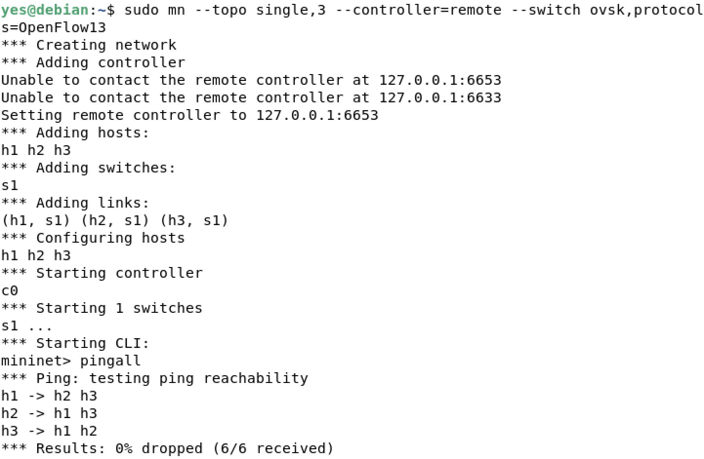
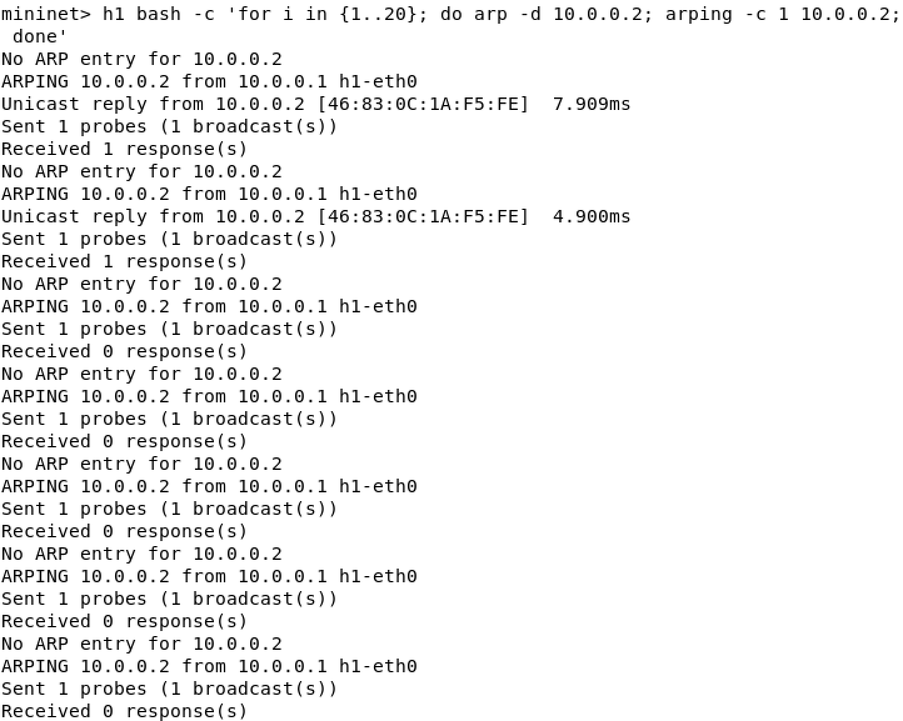
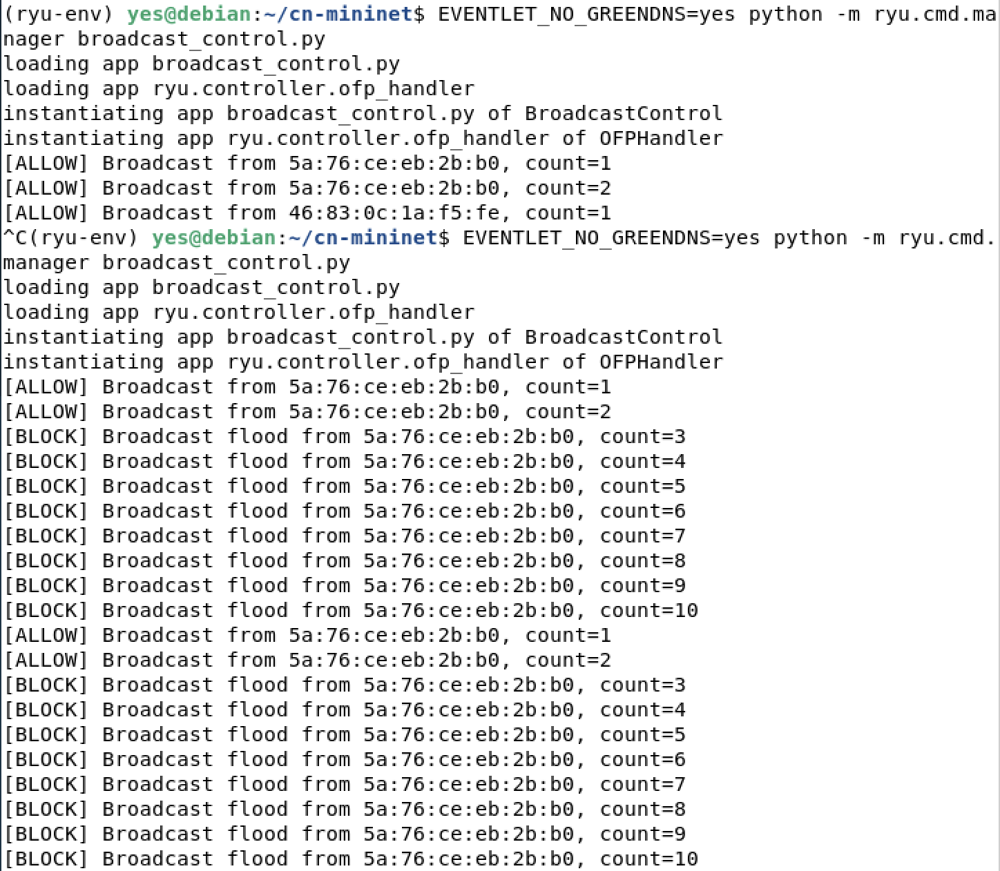

# SDN Mininet based Simulation Project: Broadcast Traffic Control
### Problem Statement: Control excessive broadcast traffic in the network.
#### Tasks:
- Detect broadcast packets
- Limit flooding
- Install selective forwarding rules
- Evaluate improvement
---

### Setup
#### Mininet
``sudo mn --topo single,3 --controller=remote --switch ovsk,protocols=OpenFlow13``
- `sudo mn`: Runs Mininet
- `--topo single,3`: one switch (single), 3 hosts
- `--controller=remote`: external controller (ryu)
- `--switch ovsk`: use Open vSwitch kernel switch
- `protocols=OpenFlow13`: switch uses OpenFlow 1.3 (the switch and the controller use the same OpenFlow protocol version)
#### Controller
Activate virtual environment and run Ryu controller:
```
source ryu-env/bin/activate 
EVENTLET_NO_GREENDNS=yes python -m ryu.cmd.manager broadcast_control.py
```
---

### Testing
#### Normal Network Behavior: Allowed
``mininet> pingall``
- All hosts should communicate successfully
- Demonstrates normal forwarding
#### Broadcast Flooding: Blocked
```mininet> h1 bash -c 'for i in {1..20}; do arp -d 10.0.0.2; arping -c 1 10.0.0.2; done'```
- Forces repeated broadcast ARP packets
- Triggers broadcast detection logic
---

### Output
#### Normal Broadcast: Allowed



- pingall shows 0% packet loss  
- Controller logs show `[ALLOW]`  
- Communication is successful
  
#### Broadcast Flooding: Blocked



- Controller logs show `[BLOCK] Broadcast flood`  
- Broadcast packets are dropped 
#### Controller Logs


